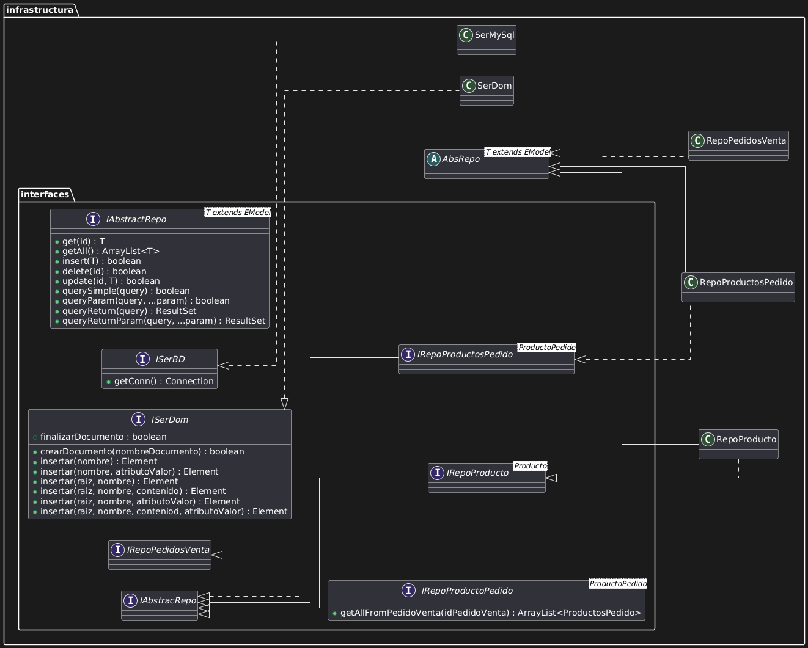
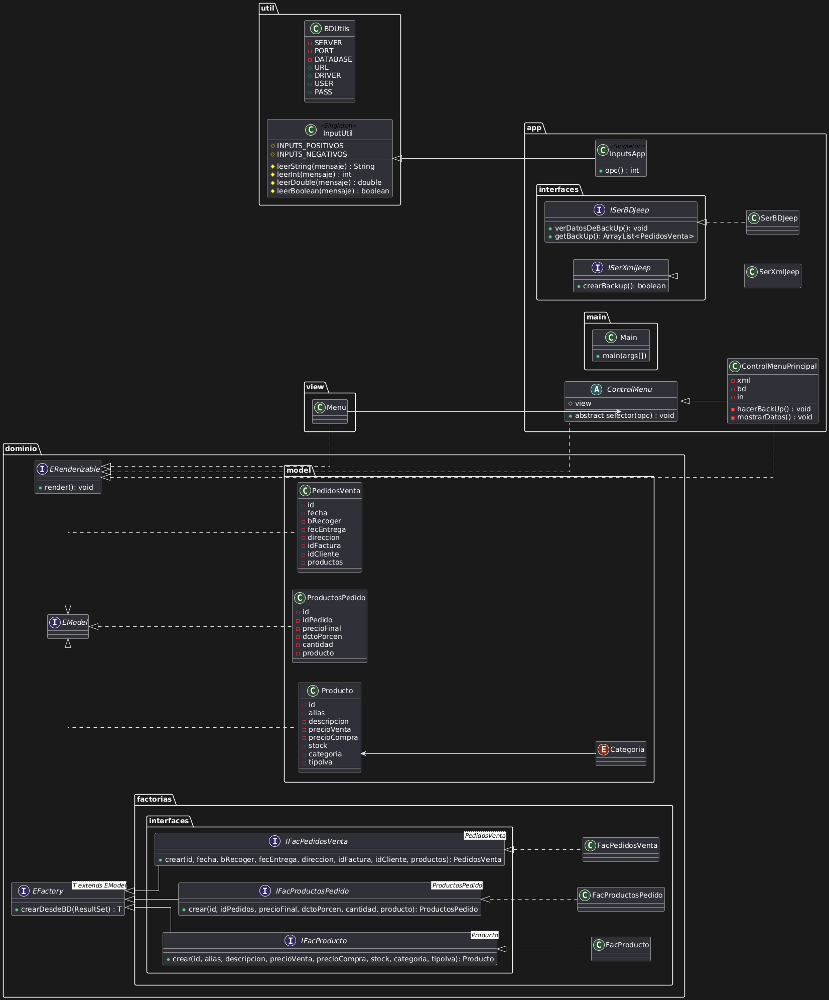

# Proyecto Acceso a Datos - Jeep Plaiaundi

Este repositorio contiene la implementación de un sistema de gestión y persistencia de datos desarrollado en Java. El enfoque principal del proyecto es la aplicación de patrones de diseño para el acceso a datos (MySQL) y la generación de un backup completo del sistema en formato XML.

## 📋 Descripción del Proyecto

El objetivo fundamental de este trabajo es desarrollar una aplicación que no solo gestione la información de la empresa (Productos y Pedidos), sino que también implemente una funcionalidad robusta para realizar una copia de seguridad (backup) de todos los datos persistidos en MySQL, exportándolos a un archivo estructurado en XML (usando el patrón DOM).

El proyecto implementa una interfaz de consola para la interacción con el usuario y realiza operaciones CRUD (Crear, Leer, Actualizar, Borrar) completas, además de funcionalidades de copia de seguridad (Backup).

## 🚀 Tecnologías Utilizadas

* **Lenguaje**: Java
* **Base de Datos**: MySQL
* **Gestión de Archivos**: XML (DOM Parser)
* **Herramientas de Diseño**: UML (PlantUML/Visual Paradigm)
* **Control de Versiones**: Git / GitHub

## 🏗️ Arquitectura y Diseño

El proyecto sigue una arquitectura modular organizada en paquetes, aplicando los siguientes patrones de diseño identificados en los diagramas UML:

### 1. Patrón Repositorio (Repository Pattern)
Se utiliza para abstraer la lógica de acceso a datos.
* **`IAbstractRepo<T>`**: Interfaz genérica que define las operaciones CRUD básicas (`get`, `insert`, `update`, `delete`).
* **`AbsRepo`**: Clase abstracta que implementa la lógica común.
* **Repositorios Concretos**: `RepoProducto`, `RepoPedidosVenta`, `RepoProductosPedido`.

### 2. Patrón Factoría (Factory Pattern)
Se utiliza para la creación de objetos del dominio a partir de los resultados de la base de datos (`ResultSet`), desacoplando la lógica de instanciación.
* **`EFactory<T>`**: Interfaz base.
* **Factorías Concretas**: `FacProducto`, `FacPedidosVenta`, `FacProductosPedido`.

### 3. Modelo de Dominio (Domain Model)
Las entidades principales del sistema que implementan `EModel` y `ERenderizable`:
* **`Producto`**: Contiene información de stock, precios y categoría (`Categoria` Enum).
* **`PedidosVenta`**: Información de cabecera del pedido (fechas, cliente, dirección).
* **`ProductosPedido`**: Relación entre pedidos y productos (cantidad, descuentos).

### 4. Patrón Singleton
Utilizado en clases de utilidad para asegurar una única instancia:
* **`InputApp` / `InputUtil`**: Gestión de entrada de datos por consola.
* **`BDUtils`**: Configuración de conexión a base de datos.

### 5. Servicios e Infraestructura
* **`SerMySQL`**: Gestión de conexiones y consultas SQL.
* **`SerDom` / `SerXmlJeep`**: Gestión de lectura y escritura de documentos XML y generación de backups.

## 📂 Estructura del Proyecto

El código fuente se organiza en los siguientes paquetes (basado en el UML):

* `app`: Lógica principal de la aplicación (`Main`, `ControlMenu`, `ControlMenuPrincipal`).
* `dominio`: Interfaces base del modelo (`EModel`, `ERenderizable`).
* `factorias`: Clases encargadas de instanciar objetos.
* `infrastructura`: Implementación técnica de repositorios y servicios de BD/XML.
* `interfaces`: Contratos para repositorios y servicios (`IAbstractRepo`, `ISerBD`).
* `model`: Clases POJO que representan las tablas de la BD.
* `util`: Utilidades de conexión (`BDUtils`) y entrada de usuario (`InputUtil`).
* `view`: Interfaz de usuario por consola (`Menu`).

## ⚙️ Configuración e Instalación

1.  **Clonar el repositorio:**
    ```bash
    git clone [https://github.com/pfalonsoplaiaundi/accesoDatosJeepPlaiaundi.git](https://github.com/pfalonsoplaiaundi/accesoDatosJeepPlaiaundi.git)
    ```

2.  **Configuración de la Base de Datos:**
    * Asegúrate de tener un servidor MySQL corriendo.
    * Revisar la clase `util.BDUtils` para configurar las credenciales (`USER`, `PASS`, `URL`) y el puerto (`PORT`).

3.  **Ejecución:**
    * Compilar el proyecto en tu IDE favorito (IntelliJ, Eclipse, NetBeans).
    * Ejecutar la clase `app.main.Main`.

## 📸 Diagramas UML

La estructura del proyecto se basa en los siguientes diagramas de clases:

### Infraestructura y Repositorios


### Modelo, Factorías y App

* **[Nombre del compañero si aplica]**

---
*Trabajo realizado para la asignatura de Acceso a Datos.*
